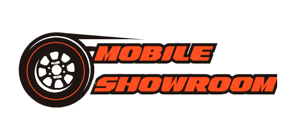
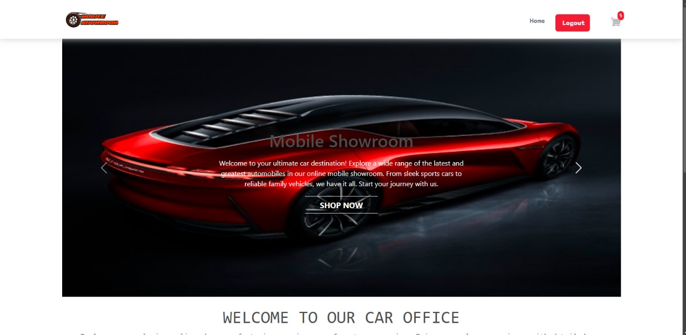
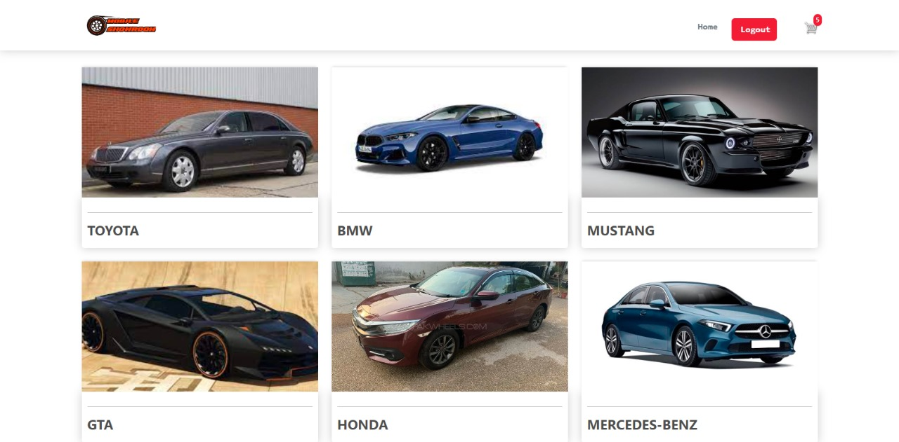
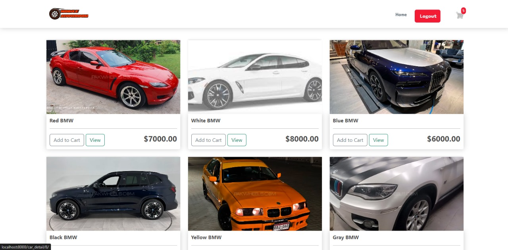
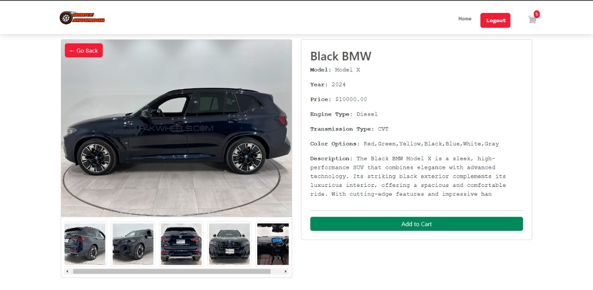
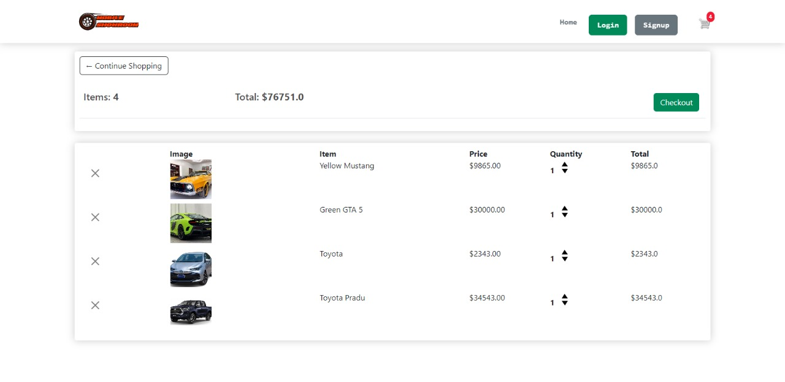
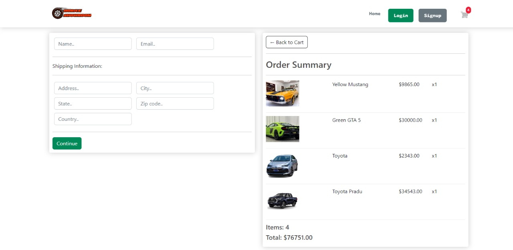
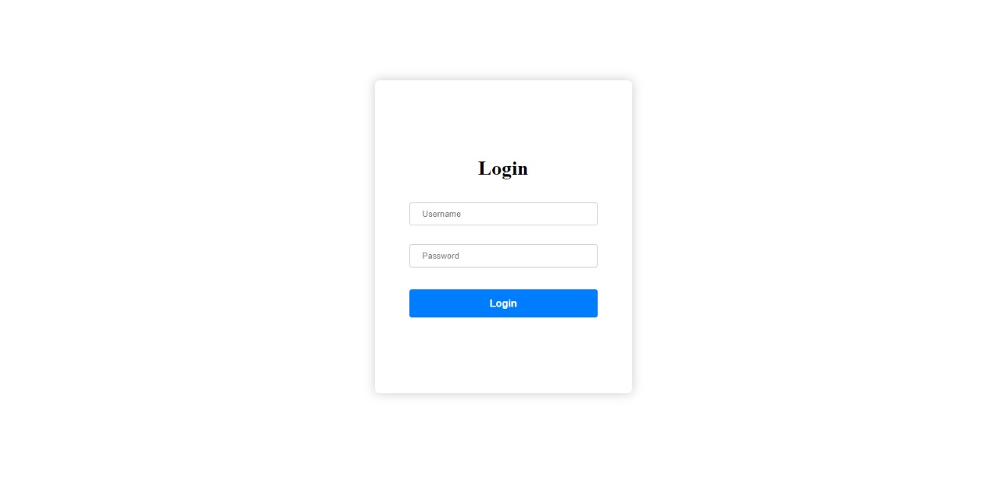
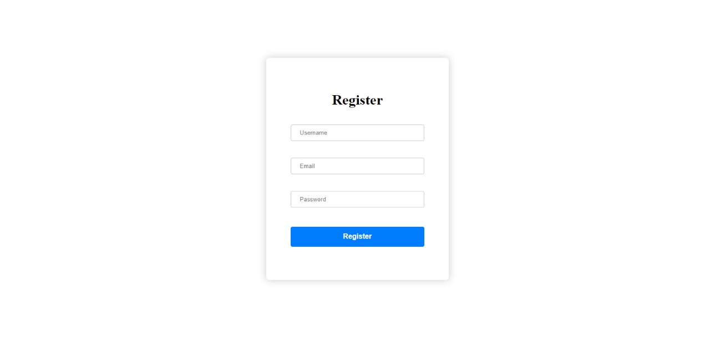
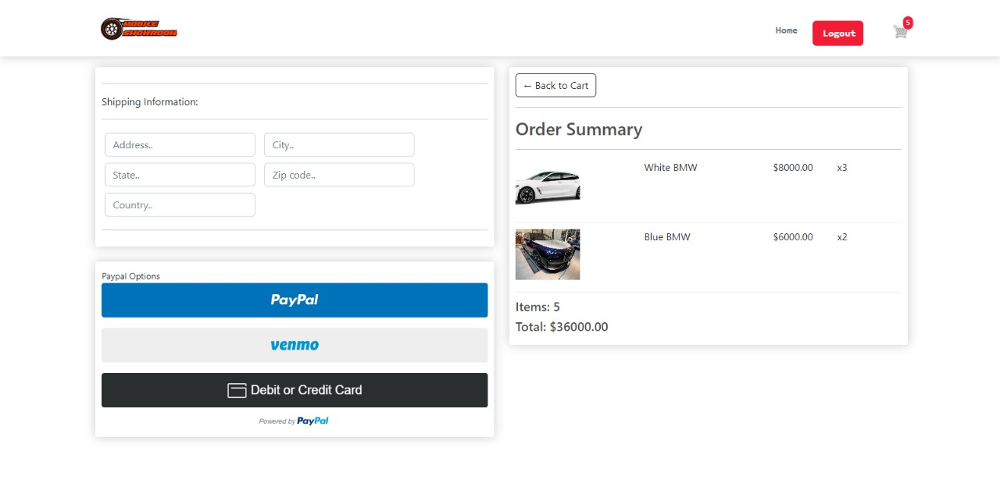

<a name="readme-top"></a>

<div align="center">
  
  <h1>Mobile Showroom for cars</h1>
  <p>
  📹An online mobile showroom website exclusively for cars.✨.
      <br/>
      Built by: @kzm
      <br/>
      <a href="https://github.com/kzmfhm/mobile-showroom"><strong>Explore the docs »</strong></a>
      <br/>
     </p>
  </div>
   <!-- TABLE OF CONTENTS -->
    <details>
    <summary>Table of Contents</summary>
   <ol>
    <li>
      <a href="#about-the-project">About The Project</a>
      <ul>
        <li><a href="#photos">Photos</a></li>
      </ul>
    </li>
    <li>
      <a href="#getting-started">Getting Started</a>
      <ul>
        <li><a href="#prerequisites">Prerequisites</a></li>
        <li><a href="#installation">Installation</a></li>
      </ul>
    </li>
    <li><a href="#support">Support</a></li>
    </ol>

  </details>
 <!-- ABOUT THE PROJECT -->

## About The Project

### Photos



















  <p align="right"><a href="#readme-top">back to top</a></p>

## Getting Started

To get a local copy up and running follow these simple example steps.

### Prerequisites

- Python 3.x
- pip (Python package installer)
- Git

### Installation

1. Clone the repository:

   ```bash
   git clone https://github.com/kzmfhm/mobile-showroom.git
   ```

2. Create and activate a virtual environment:

   ```bash
   python -m venv env
   source env/Scripts/activate  # On Windows
   # source env/bin/activate  # On macOS/Linux
   ```

3. Install the required packages:

   ```bash
   pip install -r requirements.txt
   ```

4. Start the Django project:

   ```bash
   django-admin startproject ecommerce
   cd ecommerce
   ```

5. Create the `store` app:

   ```bash
   python manage.py startapp store
   ```

6. Apply migrations:

   ```bash
   python manage.py makemigrations
   python manage.py migrate
   ```

7. Run the development server:

   ```bash
   python manage.py runserver
   ```

### Creating a Superuser

To create a superuser for accessing the Django admin panel, run:

```bash
python manage.py createsuperuser
```

### ⭐️Support

Give a ⭐️ if this project helped you!
